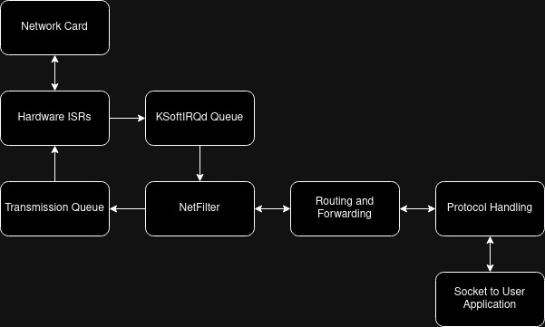

# Kernel Sources Network Training

## The TCP/IP stack

The TCP/IP model had been created as a more light weight and flexible model which would more closely resemble the real life networking protocols. Because of this the kernel code which handles networking had been called the TCP/IP stack. All kernel networking functionality is handled by the TCP/IP stack.

The kernel TCP/IP stack implementation consists of:

- Socket interface which allows applications to communicate with the TCP/IP stack over system calls.
- Protocol implementation, which handles TCP, IP, ICMP, UDP, ARP and etc.
- Routing and forwarding packets.
- Netfilter.
- Fragmentation and error handling.
- Communicating with the network hardware drivers.

>NOTE: There are standalone TCP/IP stacks for example to be used in embedded systems. In fact the Linux kernel can be compiled without networking support.

### Inbound Packet Flow



The packets enter the TCP/IP stack when a network card receives a frame and triggers a hardware IRQ which is handled by the ISR that is part of the network card driver.

The driver then queues the packet to be processed by software interrupts to offload packet processing off to the KSoftIRQd threads as processing the packets inside hardware IRQ ISRs would cause hight CPU usage.

Netfilter then handles nftables, NAT, conntrack and packet mangling after which Routing and Packet Forwarding occurs (won't go into details as these had been covered in depth in other trainings).

After that the packet is sent to the individual protocol callbacks depending on the proto field value. The IP header contains a `proto` field, which specifies the protocol of the packet so that the kernel knows how to handle it.

Finally the packet exits the TCP/IP stack and enters the user application, which also means that it crosses over from kernel space into user space. Now the packet can be received through a socket which is the main interface for the application to communicate with the TCP/IP stack. Sockets are created by the `socket` syscall, bound by the `bind()` syscall and the `getsockopt`/`setsockopt` syscalls can be used to manipulate various socket options. You can actually search for these functions in libtelio code to see examples of what they're used for.

> NOTE: It should be noted that packets are transferred into userspace by copy.

### Exercise

You can see the proto field of a packet using tcpdump with the `-v` verbose flag:

```
tcpdump -vi any
```

Let's use scapy to create a malformed TCP packet, but with a proto value 11 and send it in between client1 and server1 (or any other) and try to capture it with `tcpdump` at the receiving end by the IP of the sender: `tcpdump -vXi any dst 192.168.57.21`

What if you specify the port also? Why doesn't `tcpdump` capture the packets anymore?

What if we specify the proto number to be 17 (UDP)?

### Outbound Packet Flow

Outbound packet flow follows an identical path as inbound with one difference: there is no more need to queue the packets to be handled by soft interrupts on the KSoftIRQ threads, because the network driver handles the queuing.

## Kernel Network Parameters

Many various network parameters are stored in the kernel.

Use the following command to list all network related kernel parameters and their values.

```
sysctl net
```

If you want to see the value of a specific kernel network parameter, you can use:

```
sysctl net.ipv4.ip_forward
```

If you want to set value for a key, you'll need to add the `-w` flag:

```
sysctl -w net.ipv4.ip_forward=1
```

These parameters are also accessible through the `/proc` virtual file system. For example in the NAT network training we enabled IP forwarding by directly modifying the value of the parameter:

```
echo 1 > /proc/sys/net/ipv4/ip_forward
```

Another example of a useful parameter is enabling packet capture on loopback devices:

```
sysctl -w net.ipv4.tcp_dump_lo=1
```

>NOTE: In reality both these parameters were already set to enable so we didn't have to change them, but they can be disabled for "kernel security hardening".

You can even disable ipv6 traffic:

```
sysctl net.ipv6.conf.default.disable_ipv6=1
```
>NOTE: Because docker containers share the kernel with the host, kernel parameters are also shared. Therefore it's impossible to set separate kernel parameters for docker containers running on the same host machine.

### Network Memory

Various kernel parameters control the network memory sizes. For example net.core.rmem_max parameter describes the receive socket buffer size that can be allocated system wide. net.core.wmem_max is the same, but for the send socket buffer. net.core.rmem_default on the other hand specifies how much memory should be allocated to the receive socket buffer at creation to avoid reallocations. net.core.somaxconn on the other hands defines the maximum number of connections that can be queued by the operating system for a listening socket.

### TCP

net.ipv4.tcp_rmem and net.ipv4.tcp_wmem are parameters that control the TCP receive and send buffer sizes respectively, while net.ipv4.tcp_mem controls overall TCP memory usage. net.ipv4.tcp_max_syn_backlog controls the maximum number of TCP SYN requests that can be pending simultaneously, net.ipv4.tcp_max_orphans controls the maximum number of connections waiting in the completed connection queue.

>NOTE: As these parameters can mess up the internet connection, the associated exercise for this task is left for homework ;)

## PWRU

`pwru` is an executable which allows you to track packets as they are handled by the kernel.

More on `pwru`: https://github.com/cilium/pwru

To download and extract the standalone `pwru` executable binary you can use the following command:

```
curl -L https://github.com/cilium/pwru/releases/download/v1.0.5/pwru-linux-amd64.tar.gz | tar -xz
```

>NOTE: Update the url if you're using an arm processor, because the current one is for amd64.

### Exercise

Watch localhost port 12345 with `pwru`:

```
sudo ./pwru udp and dst 127.0.0.1 and port 12345
```

Open a UDP port on that same port:

```
socat -u UDP-LISTEN:12345,fork,reuseaddr -
```

Send a random string to that port and examine the output of `pwru`

```
echo "random_string" | socat - UDP:127.0.0.1:12345
```

From here on you can go over the output and see the actual functions being called by the TCP/IP stack while sending a udp packet to localhost.

### Homework

Try the example exercise provided by the pwru repo here: https://github.com/cilium/pwru

### Homework

Try and mess with the memory related kernel options to cause a kernel panic. For example try to decrease the size of the TCP buffers until the TCP frames won't be able to fit in them. The kernel panic should show up on `dmesg`

>NOTE: Older systems use `iptables` and newer systems use `nftables` under the hood, but the syntax may differ slightly so don't be too surprised if the same command works on your host, but not a docker container.

### Optional Homework

Do the same exercise, but instead of configuring a filter for simulating faulty routing, setup libtelio to work as a VPN and see the results.

Can you see any calls where the packets leave the kernel and enter libtelio and vice versa?
